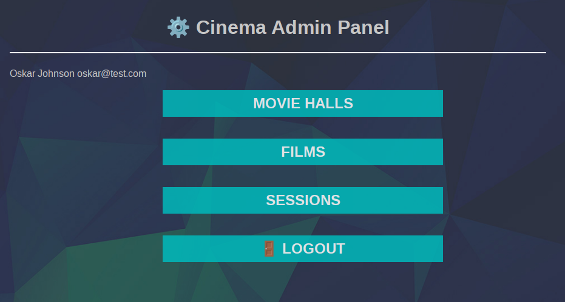
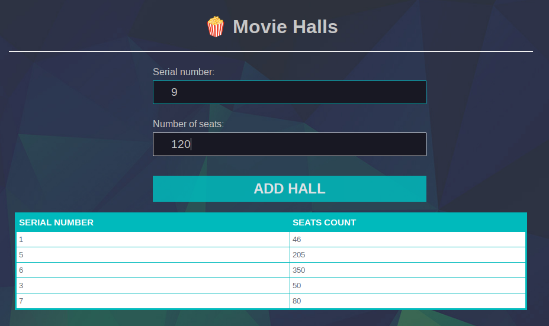
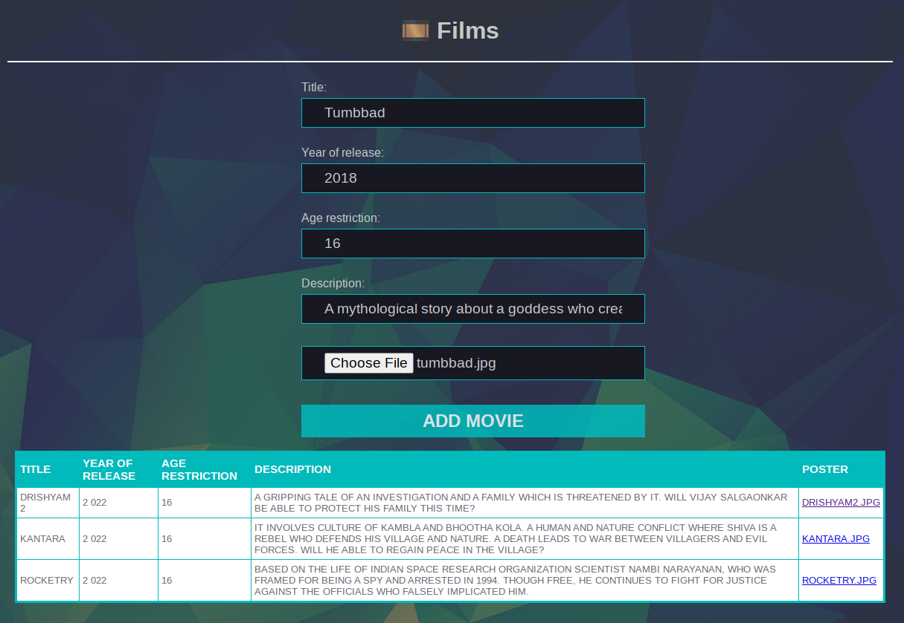

# Cinema
Implementation of a movie theater administrator functionality using Spring MVC mechanisms.
---





---

### ex00
Below are URLs for each of the pages, along with a description of required functionality.
- /admin/panel/halls
The page for working with movie halls contains a list of all movie halls created by an
administrator. The administrator can create a movie hall with a certain configuration.
To each movie hall, a serial number and number of seats are assigned.
- /admin/panel/films
A movie page contains a list of all movies created by an administrator. An administrator
can add a movie. For each movie, the title, year of release, age restrictions, and a
description are specified. It is also possible to upload a poster for a movie.
- /admin/panel/sessions
A page for working with movie shows. An administrator can create a session for a certain
movie in a certain movie hall at a required time. An administrator should be able to
indicate a ticket cost. You should implement loading of all movie and movie hall data as
attributes onto the page for subsequent selection by an administrator.

---
- Running the project
```
mvn clean package cargo:run
```
